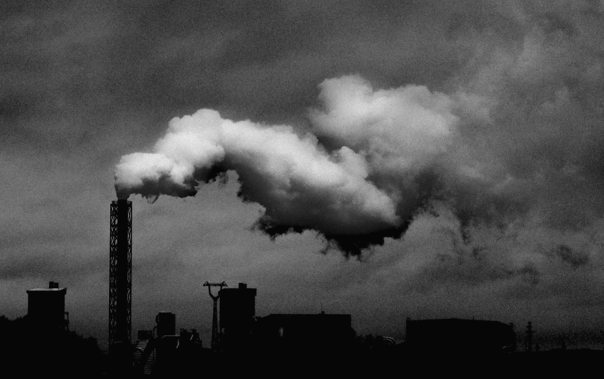
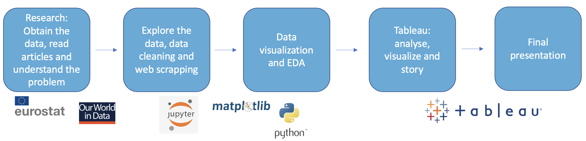
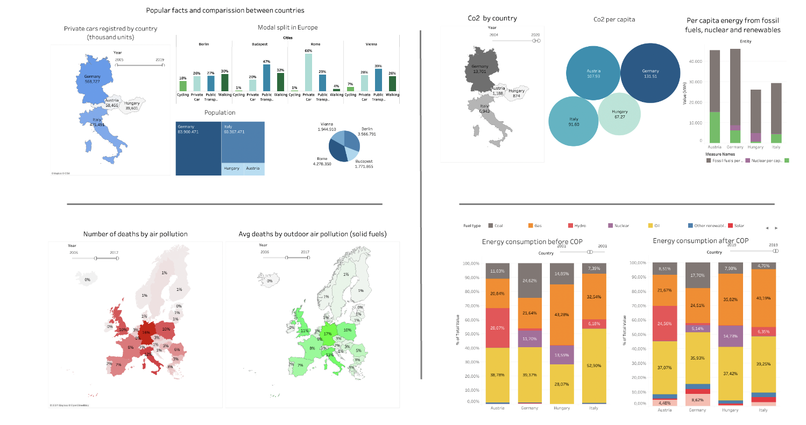

<h2 align="center"> Air Pollution 🌬 </h2>

by [Virgilio Oñate](https://github.com/vonate5), December 2021

<h2 align="center"> Agenda </h2> 

- [Project](https://github.com/vonate5/final_project#-project-)
- [Data](https://github.com/vonate5/final_project#-data-)
- [Process & tools](https://github.com/vonate5/final_project#-data-)
- [Visualization](https://github.com/vonate5/final_project#-visualization-)
- [Conclussions](https://github.com/vonate5/final_project#-conclusions-)

<h2 align="center"> Project </h2> 

**Scenario:**
Since 1990 more than 130 million people has die from air pollution. In the last years, society has focus on trying to stop this problem.
We will analyze the last two decades of the air pollution in Europe, comparing the results from different countries and trying to see the things they have in common  and those they don't.

**Challenge:**
Starting with all the european countries, we will analyze different datasets to get the best and worst air pollution countries rates (?¿?¿ cambiar)

**Problem:**

<h2 align="center"> Data </h2> 

The [data](https://github.com/vonate5/final_project/tree/main/data) we are using consists in:

- Co2 dataset with 21.949 rows and 58 features
- Energy consumption by country dataset with 6.561 rows and 12 features
- A dataset with 6.500 rows that describe the factor deaths in the world since 1990
- A dataset that gives us the amount of private cars (per thousand units) that every country has in their public register
- One dataset with the population per country and city
- Web scrape to get the modal split in the cities we want to analyze
- A dataset with 12000 rows and 22 weather features in Berlin, Rome, Vienna and Budapest from 2010 to 2017

<h2 align="center"> Process & tools </h2> 

You can find here the [code](https://github.com/vonate5/final_project/blob/main/code/final_project.ipynb). We use the following method to achieve the objective.

- Outline project and define goals
- Research data sources
- Set up project environment
- Gather data via web scraping and APIs
- EDA, clean and wrangle data using Python and Pandas
- Analysis and visualization in Tableau
- Create interactive dashboard in Tableau
- Presentation with Tableau stories

<h2 align="center"> Visualization </h2> 

The visualization for the project has been made in [Tableau](https://public.tableau.com/app/profile/virgilio.o.ate/viz/final_project_16393948109990/Story1?publish=yes). In the following picture you can see four images resuming the analysis it has being made. You can see the amount of deaths from air pollution by country, the Co2 per capita, energy emissions from fossil fuels, nuclear and renewables, energy consumption before and after the Paris Agreement and popular facts about air pollution by country and city.

<h2 align="center"> Conclusions </h2> 

After sorting, cleaning and filtering the data we need it, we manage to obtain the next results:
- Germany (1º) and Italy (2º) are the countries that worst air pollution have in Europe. On the other hand, the best are Iceland, Hungary and Austria.
- Gdp and Co2 emissions has a direct correlation. Since 2010, Germany is trying to reduce the amount of Co2 introducing new ways of energy consumption, introducing new renowables methods such as wind and hydro enrgy.
- Analyzing the Co2 emissions, Germany and Italy are the 2 countries that have more emissions, as they are the two countries with more population, that's why is interesting to analyze the Co2 emissions per capita, where Austria is in second place, having more emissions than Italy. 
- Countries that have cities with +2.5 million people need a good public transport system to reduce the amount of private cars and air pollution.
- There is a direct correlation between the public transport system and the air pollution in all the countries instead of Germany, that even though they move in a 30% by public transport, Co2 and air pollution has a high level, because +70% of the energy consumption is by fossil fuels.
- 196 Countries participate in the Paris Agreement, which  goal is to limit global warming to well below 2, preferably to 1.5 degrees Celsius, compared to pre-industrial levels. To achieve this long-term temperature goal, countries aim to reach global peaking of greenhouse gas emissions as soon as possible to achieve a climate neutral world by mid-century.

**Thanks for reading!**
🌎🌍🌏

